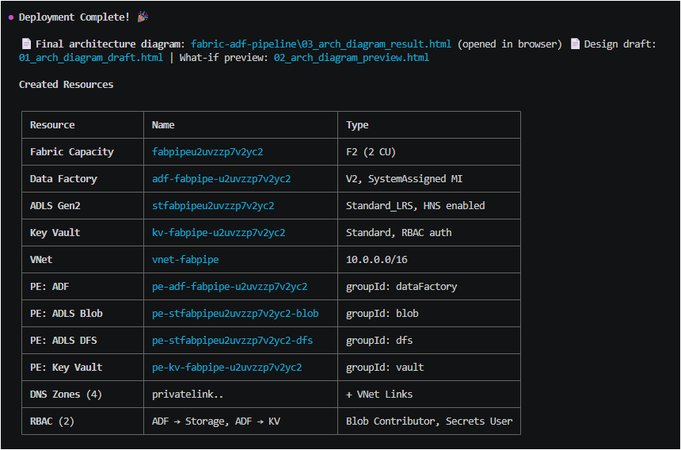
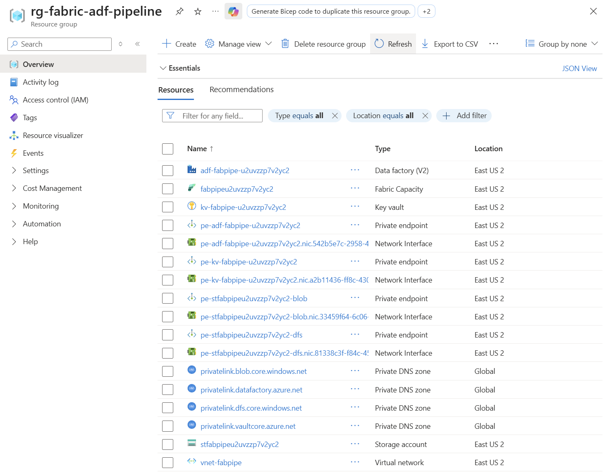

<h1 align="center">Azure Architecture Autopilot</h1>

<p align="center">
  <strong>Design → Diagram → Bicep → Deploy — all from natural language</strong>
</p>

<p align="center">
  
  
  
  
  
</p>

<p align="center">
  <b>Azure Architecture Autopilot</b> designs Azure infrastructure from natural language,<br>
  generates interactive diagrams, produces modular Bicep templates, and deploys — all through conversation.<br>
  It also scans existing resources, visualizes them as architecture diagrams, and refines them on the fly.
</p>

<!-- Hero image: interactive architecture diagram with 605+ Azure icons -->
<p align="center">
  
</p>

<p align="center">
  <em>↑ Auto-generated interactive diagram — drag, zoom, click for details, export to PNG</em>
</p>

<p align="center">
  
  &nbsp;&nbsp;
  
</p>

<p align="center">
  <em>↑ Real Azure resources deployed from the generated Bicep templates</em>
</p>

<p align="center">
  <a href="#-how-it-works">How It Works</a> •
  <a href="#-features">Features</a> •
  <a href="#%EF%B8%8F-prerequisites">Prerequisites</a> •
  <a href="#-usage">Usage</a> •
  <a href="#-architecture">Architecture</a>
</p>

---

## 🔄 How It Works

```
Path A: "Build me a RAG chatbot on Azure"
         ↓
  🎨 Design → 🔧 Bicep → ✅ Review → 🚀 Deploy

Path B: "Analyze my current Azure resources"
         ↓
  🔍 Scan → 🎨 Modify → 🔧 Bicep → ✅ Review → 🚀 Deploy
```

| Phase | Role | What Happens |
|:-----:|------|--------------|
| **0** | 🔍 Scanner | Scans existing Azure resources via `az` CLI → auto-generates architecture diagram |
| **1** | 🎨 Advisor | Interactive design through conversation — asks targeted questions with smart defaults |
| **2** | 🔧 Generator | Produces modular Bicep: `main.bicep` + `modules/*.bicep` + `.bicepparam` |
| **3** | ✅ Reviewer | Compiles with `az bicep build`, checks security & best practices |
| **4** | 🚀 Deployer | `validate` → `what-if` → preview diagram → `create` (5-step mandatory sequence) |

---

## ✨ Features

| | Feature | Description |
|---|---------|-------------|
| 📦 | **Zero Dependencies** | 605+ Azure icons bundled — no `pip install`, works offline |
| 🎨 | **Interactive Diagrams** | Drag-and-drop HTML with zoom, click details, PNG export |
| 🔍 | **Resource Scanning** | Analyze existing Azure infra → auto-generate architecture diagrams |
| 💬 | **Natural Language** | *"It's slow"*, *"reduce costs"*, *"add security"* → guided resolution |
| 📊 | **Live Verification** | API versions, SKUs, model availability fetched from MS Docs in real-time |
| 🔒 | **Secure by Default** | Private Endpoints, RBAC, managed identity — no secrets in files |
| ⚡ | **Parallel Preload** | Next-phase info loaded while waiting for user input |
| 🌐 | **Multi-Language** | Auto-detects user language — responds in English, Korean, or any language |

---

## ⚙️ Prerequisites

| Tool | Required | Install |
|------|:--------:|---------|
| **GitHub Copilot CLI** | ✅ | [Install guide](https://docs.github.com/copilot/concepts/agents/about-copilot-cli) |
| **Azure CLI** | ✅ | `winget install Microsoft.AzureCLI` / `brew install azure-cli` |
| **Python 3.10+** | ✅ | `winget install Python.Python.3.12` / `brew install python` |

> No additional packages required — the diagram engine is bundled in `scripts/`.

### 🤖 Recommended Models

| | Models | Notes |
|---|--------|-------|
| 🏆 **Best** | Claude Opus 4.5 / 4.6 | Most reliable for all 5 phases |
| ✅ **Recommended** | Claude Sonnet 4.5 / 4.6 | Best cost-performance balance |
| ⚠️ **Minimum** | Claude Sonnet 4, GPT-5.1+ | May skip steps in complex architectures |

---

## 🚀 Usage

### Path A — Build new infrastructure

```
"Build a RAG chatbot with Foundry and AI Search"
"Create a data platform with Databricks and ADLS Gen2"
"Deploy Fabric + ADF pipeline with private endpoints"
"Set up a microservices architecture with AKS and Cosmos DB"
```

### Path B — Analyze & modify existing resources

```
"Analyze my current Azure infrastructure"
"Scan rg-production and show me the architecture"
"What resources are in my subscription?"
```

Then modify through conversation:
```
"Add 3 VMs to this architecture"
"The Foundry endpoint is slow — what can I do?"
"Reduce costs — downgrade AI Search to Basic"
"Add private endpoints to all services"
```

### 📂 Output Structure

```
<project-name>/
├── 00_arch_current.html         ← Scanned architecture (Path B)
├── 01_arch_diagram_draft.html   ← Design diagram
├── 02_arch_diagram_preview.html ← What-if preview
├── 03_arch_diagram_result.html  ← Deployment result
├── main.bicep                   ← Orchestration
├── main.bicepparam              ← Parameter values
└── modules/
    └── *.bicep                  ← Per-service modules
```

---

## 📁 Architecture

```
SKILL.md                            ← Lightweight router (~170 lines)
│
├── scripts/                         ← Embedded diagram engine
│   ├── generator.py                 ← Interactive HTML generator
│   ├── icons.py                     ← 605+ Azure icons (Base64 SVG)
│   └── cli.py                       ← CLI entry point
│
└── references/                      ← Phase instructions + patterns
    ├── phase0-scanner.md            ← 🔍 Resource scanning
    ├── phase1-advisor.md            ← 🎨 Architecture design
    ├── bicep-generator.md           ← 🔧 Bicep generation
    ├── bicep-reviewer.md            ← ✅ Code review
    ├── phase4-deployer.md           ← 🚀 Deployment pipeline
    ├── service-gotchas.md           ← Required properties & PE mappings
    ├── azure-common-patterns.md     ← Security & naming patterns
    ├── azure-dynamic-sources.md     ← MS Docs URL registry
    ├── architecture-guidance-sources.md
    └── ai-data.md                   ← AI/Data service domain pack
```

> **Self-contained** — `SKILL.md` is a lightweight router. All phase logic lives in `references/`. The diagram engine is embedded in `scripts/` with no external dependencies.

---

## 📊 Supported Services (70+ types)

All Azure services supported. AI/Data services have optimized templates; others are auto-looked up from MS Docs.

**Key types:** `ai_foundry` · `openai` · `ai_search` · `storage` · `adls` · `keyvault` · `fabric` · `databricks` · `aks` · `vm` · `app_service` · `function_app` · `cosmos_db` · `sql_server` · `postgresql` · `mysql` · `synapse` · `adf` · `apim` · `service_bus` · `logic_apps` · `event_grid` · `event_hub` · `container_apps` · `app_insights` · `log_analytics` · `firewall` · `front_door` · `load_balancer` · `expressroute` · `sentinel` · `redis` · `iot_hub` · `digital_twins` · `signalr` · `acr` · `bastion` · `vpn_gateway` · `data_explorer` · `document_intelligence` ...


---

## 📄 License

MIT © [Jeonghoon Lee](https://github.com/whoniiii)
