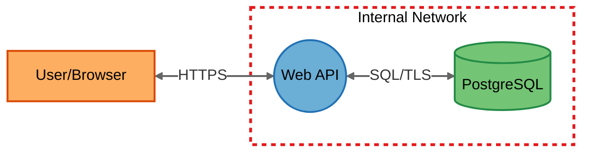
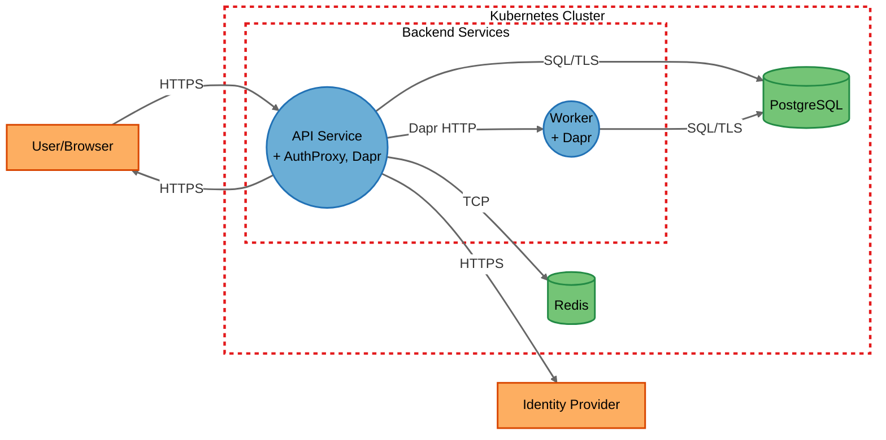
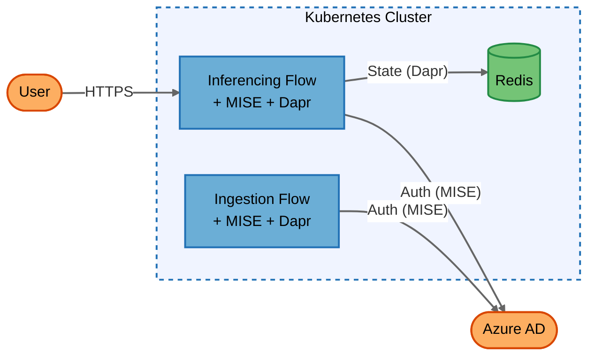
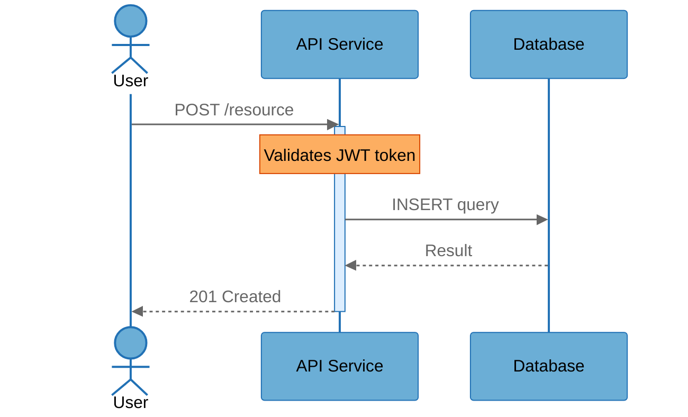

# Diagram Conventions — Mermaid Diagrams for Threat Models & Architecture

This file contains ALL rules for creating Mermaid diagrams in threat model reports. It is self-contained — everything needed to produce correct diagrams is here.

---

## ⛔ CRITICAL RULES — READ BEFORE DRAWING ANY DIAGRAM

These rules are the most frequently violated. Read them first, and re-check after every diagram.

### Rule 1: Kubernetes Sidecar Co-location (MANDATORY)

When the target system runs on Kubernetes, **containers that share a Pod must be represented together** — never as independent standalone components.

**DO THIS — annotate the primary container's label:**
```
InferencingFlow(("Inferencing Flow<br/>+ MISE, Dapr")):::process
IngestionFlow(("Ingestion Flow<br/>+ MISE, Dapr")):::process
VectorDbApi(("VectorDB API<br/>+ Dapr")):::process
```

**DO NOT DO THIS — never create standalone sidecar nodes:**
```
❌ MISE(("MISE Sidecar")):::process
❌ DaprSidecar(("Dapr Sidecar")):::process
❌ InferencingFlow -->|"localhost"| MISE
```

**Why:** Sidecars (Dapr, MISE/auth proxy, Envoy, Istio proxy, log collectors) share the Pod's network namespace, lifecycle, and security context with their primary container. They are NOT independent services.

**This rule applies to ALL diagram types:** architecture, threat model, summary.

### Rule 2: No Intra-Pod Flows (MANDATORY)

**DO NOT draw data flows between a primary container and its sidecars.** These are implicit from the co-location annotation.

```
❌ InferencingFlow -->|"localhost:3500"| DaprSidecar
❌ InferencingFlow -->|"localhost:8080"| MISE
```

Intra-pod communication happens on localhost — it has no security boundary and should not appear in the diagram.

### Rule 3: Cross-Boundary Sidecar Flows Originate from Host Container

When a sidecar makes a call that crosses a trust boundary (e.g., MISE → Azure AD, Dapr → Redis), draw the arrow **from the host container node** — never from a standalone sidecar node.

```
✅ InferencingFlow -->|"HTTPS (MISE auth)"| AzureAD
✅ IngestionAPI -->|"HTTPS (MISE auth)"| AzureAD
✅ InferencingFlow -->|"TCP (Dapr)"| Redis

❌ MISESidecar -->|"HTTPS"| AzureAD
❌ DaprSidecar -->|"TCP"| Redis
```

If multiple pods have the same sidecar calling the same external target, draw one arrow per host container. Multiple arrows to the same target is correct.

### Rule 4: Element Table — No Separate Sidecar Rows

Do NOT add separate Element Table rows for sidecars. Describe them in the host container's description column:

```
✅ | Inferencing Flow | Process | API service + MISE auth proxy + Dapr sidecar | Backend Services |
❌ | MISE Sidecar     | Process | Auth proxy for Inferencing Flow              | Backend Services |
```

If a sidecar class has its own threat surface (e.g., MISE auth bypass), it gets a `## Component` section in STRIDE analysis — but it is still NOT a separate diagram node.

---

## Pre-Render Checklist (VERIFY BEFORE FINALIZING)

After drawing ANY diagram, verify:

- [ ] **Every K8s service node annotated with sidecars?** — Each pod's process node includes `<br/>+ SidecarName` for all co-located containers
- [ ] **Zero standalone sidecar nodes?** — Search diagram for any node named `MISE`, `Dapr`, `Envoy`, `Istio`, `Sidecar` — these must NOT exist as separate nodes
- [ ] **Zero intra-pod localhost flows?** — No arrows between a container and its sidecars on localhost
- [ ] **Cross-boundary sidecar flows from host?** — All arrows to external targets (Azure AD, Redis, etc.) originate from the host container node
- [ ] **Background forced to white?** — `%%{init}%%` block includes `'background': '#ffffff'`
- [ ] **All classDef include `color:#000000`?** — Black text on every element
- [ ] **`linkStyle default` present?** — `stroke:#666666,stroke-width:2px`
- [ ] **All labels quoted?** — `["Name"]`, `(("Name"))`, `-->|"Label"|`
- [ ] **Subgraph/end pairs matched?** — Every `subgraph` has a closing `end`
- [ ] **Trust boundary styles applied?** — `stroke:#e31a1c,stroke-width:3px,stroke-dasharray: 5 5`

---

## Color Palette

> **⛔ CRITICAL: Use ONLY these exact hex codes. Do NOT invent colors, use Chakra UI colors (#4299E1, #48BB78, #E53E3E), Tailwind colors, or any other palette. The colors below are from ColorBrewer qualitative palettes for colorblind accessibility. COPY the classDef lines VERBATIM from this file.**

These colors are shared across ALL Mermaid diagrams. Colors are from ColorBrewer qualitative palettes — designed for colorblind accessibility.

| Color Role | Fill | Stroke | Used For |
|------------|------|--------|----------|
| Blue | `#6baed6` | `#2171b5` | Services/Processes |
| Amber | `#fdae61` | `#d94701` | External Interactors |
| Green | `#74c476` | `#238b45` | Data Stores |
| Red | n/a | `#e31a1c` | Trust boundaries (threat model only) |
| Dark gray | n/a | `#666666` | Arrows/links |
| Text | all: `color:#000000` | | Black text on every element |

### Design Rationale

| Element | Fill | Stroke | Text | Why |
|---------|------|--------|------|-----|
| Process | `#6baed6` | `#2171b5` | `#000000` | Medium blue — visible on both themes |
| External Interactor | `#fdae61` | `#d94701` | `#000000` | Warm amber — distinct from blue/green |
| Data Store | `#74c476` | `#238b45` | `#000000` | Medium green — natural for storage |
| Trust Boundary | none | `#e31a1c` | n/a | Red dashed — 3px for visibility |
| Arrows/Links | n/a | `#666666` | n/a | Dark gray on white background |
| Background | `#ffffff` | n/a | n/a | Forced white for dark theme safety |

---

## Forced White Background (REQUIRED)

Every Mermaid diagram — flowchart and sequence — MUST include an `%%{init}%%` block that forces a white background. This ensures diagrams render correctly in dark themes.

> **⛔ CRITICAL: Do NOT add `primaryColor`, `secondaryColor`, `tertiaryColor`, or ANY custom color keys to themeVariables. The init block controls ONLY the background and line color. ALL element colors come from classDef lines — never from themeVariables. If you add color overrides to themeVariables, they will BREAK the classDef palette.**

### Flowchart Init Block

Add as the **first line** of every `.mmd` file or ` ```mermaid ` flowchart:

```
%%{init: {'theme': 'base', 'themeVariables': { 'background': '#ffffff', 'primaryColor': '#ffffff', 'lineColor': '#666666' }}}%%
```

**THE ABOVE IS THE ONLY ALLOWED INIT BLOCK FOR FLOWCHARTS.** Do not modify it. Do not add keys. Copy it verbatim.

### Arrow / Link Default Styling

Add after classDef lines:

```
linkStyle default stroke:#666666,stroke-width:2px
```

### Sequence Diagram Init Block

Sequence diagrams cannot use `classDef`. Use this init block:

```
%%{init: {'theme': 'base', 'themeVariables': {
  'background': '#ffffff',
  'actorBkg': '#6baed6', 'actorBorder': '#2171b5', 'actorTextColor': '#000000',
  'signalColor': '#666666', 'signalTextColor': '#666666',
  'noteBkgColor': '#fdae61', 'noteBorderColor': '#d94701', 'noteTextColor': '#000000',
  'activationBkgColor': '#ddeeff', 'activationBorderColor': '#2171b5',
  'sequenceNumberColor': '#767676',
  'labelBoxBkgColor': '#f0f0f0', 'labelBoxBorderColor': '#666666', 'labelTextColor': '#000000',
  'loopTextColor': '#000000'
}}}%%
```

---

## Diagram Type: Threat Model (DFD)

Used in: `1-threatmodel.md`, `1.1-threatmodel.mmd`, `1.2-threatmodel-summary.mmd`

### `.mmd` File Format — CRITICAL

The `.mmd` file contains **raw Mermaid source only** — no markdown, no code fences. The file must start on line 1 with:
```
%%{init: {'theme': 'base', 'themeVariables': { 'background': '#ffffff', 'primaryColor': '#ffffff', 'lineColor': '#666666' }}}%%
```
Followed by `flowchart LR` on line 2. NEVER use `flowchart TB`.

**WRONG**: File starts with ` ```plaintext ` or ` ```mermaid ` — these are code fences and corrupt the `.mmd` file.

### ClassDef & Shapes

```
classDef process fill:#6baed6,stroke:#2171b5,stroke-width:2px,color:#000000
classDef external fill:#fdae61,stroke:#d94701,stroke-width:2px,color:#000000
classDef datastore fill:#74c476,stroke:#238b45,stroke-width:2px,color:#000000
```

| Element Type | Shape Syntax | Example |
|-------------|-------------|---------|
| Process | `(("Name"))` circle | `WebApi(("Web API")):::process` |
| External Interactor | `["Name"]` rectangle | `User["User/Browser"]:::external` |
| Data Store | `[("Name")]` cylinder | `Database[("PostgreSQL")]:::datastore` |

### Trust Boundary Styling

```
subgraph BoundaryId["Display Name"]
    %% elements inside
end
style BoundaryId fill:none,stroke:#e31a1c,stroke-width:3px,stroke-dasharray: 5 5
```

### Flow Labels

```
Unidirectional:  A -->|"Label"| B
Bidirectional:   A <-->|"Label"| B
```

### Data Flow IDs

- Detailed flows: `DF01`, `DF02`, `DF03`...
- Summary flows: `SDF01`, `SDF02`, `SDF03`...

### Complete DFD Template



### Kubernetes DFD Template (With Sidecars)



**Key points:**
- AuthProxy and Dapr are annotated on the host node (`+ AuthProxy, Dapr`), not as separate nodes
- `ApiService -->|"HTTPS"| IdP` = auth proxy's cross-boundary call, drawn from host container
- `ApiService -->|"TCP"| Redis` = Dapr's cross-boundary call, drawn from host container
- No intra-pod flows drawn

---

## Diagram Type: Architecture

Used in: `0.1-architecture.md` only

### ClassDef & Shapes

```
classDef service fill:#6baed6,stroke:#2171b5,stroke-width:2px,color:#000000
classDef external fill:#fdae61,stroke:#d94701,stroke-width:2px,color:#000000
classDef datastore fill:#74c476,stroke:#238b45,stroke-width:2px,color:#000000
```

| Element Type | Shape Syntax | Notes |
|-------------|-------------|-------|
| Services/Processes | `["Name"]` or `(["Name"])` | Rounded rectangles or stadium |
| External Actors | `(["Name"])` with `external` class | Amber distinguishes them |
| Data Stores | `[("Name")]` cylinder | Same as DFD |
| **DO NOT** use circles `(("Name"))` | | Reserved for DFD threat model diagrams |

### Layer Grouping Styling (NOT trust boundaries)

```
style LayerId fill:#f0f4ff,stroke:#2171b5,stroke-width:2px,stroke-dasharray: 5 5
```

Layer colors:
- Backend: `fill:#f0f4ff,stroke:#2171b5` (light blue)
- Data: `fill:#f0fff0,stroke:#238b45` (light green)
- External: `fill:#fff8f0,stroke:#d94701` (light amber)
- Infrastructure: `fill:#f5f5f5,stroke:#666666` (light gray)

### Flow Conventions

- Label with **what is communicated**: `"User queries"`, `"Auth tokens"`, `"Log data"`
- Protocol can be parenthetical: `"Queries (gRPC)"`
- Simpler arrows than DFD — use `-->` without requiring bidirectional flows

### Kubernetes Pods in Architecture Diagrams

Show pods with their full container composition:
```
inf["Inferencing Flow<br/>+ MISE + Dapr"]:::service
ing["Ingestion Flow<br/>+ MISE + Dapr"]:::service
```

### Key Difference from DFD

The architecture diagram shows **what the system does** (logical components and interactions). The threat model DFD shows **what could be attacked** (trust boundaries, data flows with protocols, element types). They share many components but serve different purposes.

### Complete Architecture Diagram Template

```mermaid
%%{init: {'theme': 'base', 'themeVariables': { 'background': '#ffffff', 'primaryColor': '#ffffff', 'lineColor': '#666666' }}}%%
flowchart LR
    classDef service fill:#6baed6,stroke:#2171b5,stroke-width:2px,color:#000000
    classDef external fill:#fdae61,stroke:#d94701,stroke-width:2px,color:#000000
    classDef datastore fill:#74c476,stroke:#238b45,stroke-width:2px,color:#000000
    linkStyle default stroke:#666666,stroke-width:2px

    User(["User"]):::external

    subgraph Backend["Backend Services"]
        Api["API Service"]:::service
        Worker["Worker"]:::service
    end

    subgraph Data["Data Layer"]
        Db[("Database")]:::datastore
        Cache[("Cache")]:::datastore
    end

    User -->|"HTTPS"| Api
    Api --> Worker
    Worker --> Db
    Api --> Cache

    style Backend fill:#f0f4ff,stroke:#2171b5,stroke-width:2px,stroke-dasharray: 5 5
    style Data fill:#f0fff0,stroke:#238b45,stroke-width:2px,stroke-dasharray: 5 5
```



### Kubernetes Architecture Template



---

## Sequence Diagram Rules

Used in: `0.1-architecture.md` top scenarios

- The **first 3 scenarios MUST** each include a Mermaid `sequenceDiagram`
- Scenarios 4-5 may optionally include one
- Use the **Sequence Diagram Init Block** above at the top of each
- Use `participant` aliases matching the Key Components table
- Show activations (`activate`/`deactivate`) for request-response patterns
- Include `Note` blocks for security-relevant steps (e.g., "Validates JWT token")
- Keep diagrams focused — core workflow, not every error path

### Complete Sequence Diagram Example



---

## Summary Diagram Rules

Used in: `1.2-threatmodel-summary.mmd` (generated only when detailed diagram has >15 elements or >4 trust boundaries)

1. **All trust boundaries must be preserved** — never combine or omit
2. **Only combine components that are NOT**: entry points, core flow components, security-critical services, primary data stores
3. **Candidates for aggregation**: supporting infrastructure, secondary caches, multiple externals at same trust level
4. **Combined element labels must list contents:**
   ```
   DataLayer[("Data Layer<br/>(UserDB, OrderDB, Redis)")]
   SupportServices(("Supporting<br/>(Logging, Monitoring)"))
   ```
5. Use `SDF` prefix for summary data flows: `SDF01`, `SDF02`, ...
6. Include mapping table in `1-threatmodel.md`:
   ```
   | Summary Element | Contains | Summary Flows | Maps to Detailed Flows |
   ```

---

## Naming Conventions

| Item | Convention | Example |
|------|-----------|---------|
| Element ID | PascalCase, no spaces | `WebApi`, `UserDb` |
| Display Name | Human readable in quotes | `"Web API"`, `"User Database"` |
| Flow Label | Protocol or action in quotes | `"HTTPS"`, `"SQL"`, `"gRPC"` |
| Flow ID | Unique short identifier | `DF01`, `DF02` |
| Boundary ID | PascalCase | `InternalNetwork`, `PublicDMZ` |

**CRITICAL: Always quote ALL text in Mermaid diagrams:**
- Element labels: `["Name"]`, `(("Name"))`, `[("Name")]`
- Flow labels: `-->|"Label"|`
- Subgraph titles: `subgraph ID["Title"]`

---

## Quick Reference - Shapes

```
External Interactor:  ["Name"]     → Rectangle
Process:              (("Name"))   → Circle (double parentheses)
Data Store:           [("Name")]   → Cylinder
```

## Quick Reference - Flows

```
Unidirectional:  A -->|"Label"| B
Bidirectional:   A <-->|"Label"| B
```

## Quick Reference - Boundaries

```
subgraph BoundaryId["Display Name"]
    %% elements inside
end
style BoundaryId fill:none,stroke:#e31a1c,stroke-width:3px,stroke-dasharray: 5 5
```

---

## STRIDE Analysis — Sidecar Implications

Although sidecars are NOT separate diagram nodes, they DO appear in STRIDE analysis:

- Sidecars with distinct threat surfaces (e.g., MISE auth bypass, Dapr mTLS) get their own `## Component` section in `2-stride-analysis.md`
- The component heading notes which pods they are co-located in
- Threats related to intra-pod communication (localhost bypass, shared namespace) go under the **primary container's** component section
- **Pod Co-location** line in STRIDE template: list co-located sidecars (e.g., "MISE Sidecar, Dapr Sidecar")
